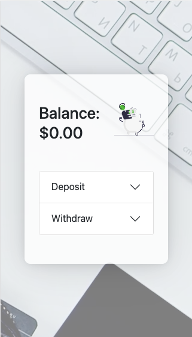

# MakersValley Coding Challenge

This is a basic, mock banking app where you can see your balance and deposit / withdraw funds.

## Demo

Click [here](https://adriansseur.github.io/mv_frontend_challenge_1/) to see the live demo.

## Technologies used

1. React, Javascript, HTML, CSS
2. Redux, React-Redux (state management)
3. Bootstrap, React-Bootstrap (starter style, components, and animations)
4. GSAP (Javascript animations library)

## Instruction to set up locally

1. Download and extract the ZIP from this repository. Make sure the branch is main, not gh-pages. (gh-pages is a branch that holds a processed bundle of the files in main, processed by create-react-app)
2. Open the root directory of the downloaded file in your preferred text editor or terminal.
3. Run the command `npm install`, this will install all necessary dependencies.
4. Once finished, run the command `npm start` to start this Banking App.
5. The app should now be running in your browser!

## Test my code

The deposit and withdraw functions only accept numbers. These numbers can have a maximum of 2 decimals. No currency symbols or commas are allowed.

## Thanks

Comments and suggestions much appreciated. Thanks for visiting this repo 😁
